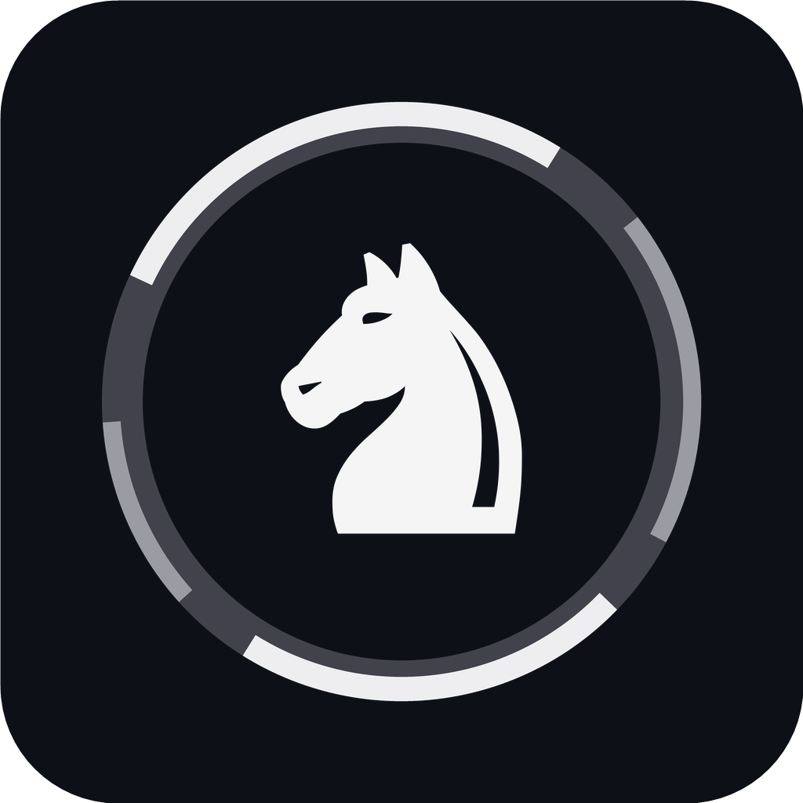

<div align="center">

<picture>
  <source media="(prefers-color-scheme: dark)" srcset="Assets/Brand/chess-kit-icon.png">
  
</picture>

# ChessKit

**Real-time chess analysis for any board on your screen.**

Screen-vision board recognition · a click-through overlay · any UCI engine · a full analysis suite.


[Download](https://github.com/chesskit-ai/chesskit-client/releases/latest) · [chesskit.ai](https://chesskit.ai)

</div>

---

ChessKit watches a chessboard rendered in **any window on your screen** — a website, a stream, a PDF, a game client — recognizes the position with computer vision, and paints the best moves as arrows and an evaluation bar in a **transparent, click-through overlay** locked to the board, live, as you play. There is no browser extension, no integration, and no API into the host app: it reads the screen.

It also ships a complete standalone suite — a full analysis board, engine-vs-engine matches, and full-game review.

This repository is the **client**. The board-recognition model and the primary engine run as hosted services; the client authorizes against them with a **hardware-bound license** (your machine's hardware ID *is* the identity — there's no username/password account). Any local UCI engine can drive offline analysis with no connection at all.

---

## How it works

The hot path runs locally at 30–60 fps; only the parts that need it touch the network.

1. **Capture** — the target window is grabbed via GPU **DXGI Desktop Duplication** (GDI fallback), so it reads hardware-accelerated content that screenshot tools can't. — `ScreenCapture`
2. **Detect** — the board crop is recognized by a hosted vision model that returns a FEN. An incremental **"delta" protocol** uploads only the squares that *changed* since the last frame (gzipped), and a **window tracker** follows the board between detections so vision doesn't re-run every frame. — `BoardVisionDetector`, `WindowTracker`
3. **Analyze** — the position is evaluated by the hosted engine *or* your own local UCI engine, with a principal-variation cache and speculative prefetch that keep arrows instant even in bullet. — `UCIEngine`, `RemoteEngineClient`
4. **Render** — best-move arrows and the evaluation bar are drawn in a layered, **click-through** overlay pinned to the board — you keep playing underneath it. — `OverlayForm`, `EvalBarForm`

Typical end-to-end latency from a detected move to arrows on screen is **well under 100 ms**.

---

## Features

### 🎯 Live screen-vision overlay
- Recognizes a board in **any on-screen window** — no extension, no integration, nothing installed into the host app.
- A **click-through, always-on-top overlay**: strength-ordered best-move arrows and a flip-aware evaluation bar painted on the real board.
- **Follows the board** as the window moves, scrolls, or resizes.
- **W / B / W+B** perspective modes — analyze for White, Black, or both sides at once.

### ⌨️ The F1 command bar
- A floating, always-on-top toolbar you summon with **F1** at any time.
- Switch engine, set line count and depth, flip the perspective mode, and see your shortcuts — without ever leaving the board.
- **Remappable global hotkeys** for everything.

### ♟️ Engines, your way
- Use the **hosted engine** or drop in **any local UCI engine** — **Stockfish ships in the box**.
- Configurable **depth up to 32 (or infinite)**, **up to 6 lines** (MultiPV), plus threads and hash.
- **Strength limiting** (UCI_Elo / Skill) and **human-like play profiles** for realistic sparring.
- Embedded **opening book**.

### 📋 Standalone analysis board
- A full board independent of the screen overlay: **PGN import/export**, the embedded opening book, move-by-move navigation, and an inline evaluation bar.
- **Engine-vs-engine matches** with clocks and per-side scoring — pit any two engines (or strengths) against each other.
- **Mirror mode** — mirror the live detected board into a side-by-side window for deeper study.

### 🧠 Game analysis & review
- Full-game review with per-move **accuracy** and **blunder / mistake / inaccuracy** detection, plus a summary that surfaces the **critical moments** — click any move to jump the board straight there.

### ⚡ Built for speed & privacy
- PV cache + speculative prefetch keep the overlay responsive on the fastest time controls.
- **No account** — licensing binds to a hashed **hardware ID** (raw serials are never sent or stored).
- **Telemetry is opt-in and off by default**; logging is off by default.

---

## Quick start

1. Download the latest release, unzip it anywhere, and run **`ChessKit.exe`** — fully portable, no installer, no runtime.
2. Open a chessboard in any window.
3. Press **F1** for the toolbar, pick a perspective (**W / B / W+B**) — arrows and the eval bar appear on the board.
4. Want a full board, PGN review, engine matches, or game analysis? Open the **analysis board** from the toolbar.

---

## Download & run

Grab the latest **[release](https://github.com/chesskit-ai/chesskit-client/releases/latest)** (or get it from **[chesskit.ai](https://chesskit.ai)**), unzip, and run `ChessKit.exe`. The build is **self-contained and portable** — no install, no .NET runtime, no registry writes. To remove it, just delete the folder.

### Bring your own engine
Drop any **UCI engine** into the `engines/` folder next to the executable and select it in the toolbar — the bundled **Stockfish** also works out of the box. A local engine gives you **unlimited, offline analysis on the analysis board**: no connection, no limits.

### What a local engine does *not* unlock
The **live screen-vision detection is a hosted service** — the recognition model runs on ChessKit's servers. For **unlicensed (Free)** users that hosted detection is **rate-limited** (a per-machine move window with a cooldown). A local engine analyzes positions for free, but it **does not bypass the hosted vision limit** — the *detection* is the hosted, gated piece, not the engine.

| | Free (unlicensed) | Licensed |
|---|---|---|
| Live screen-vision overlay | ✅ rate-limited (hosted detection) | ✅ full speed |
| Analysis board + your local UCI engine | ✅ unlimited, offline | ✅ unlimited |
| Hosted engine · engine matches · deep game review | limited | ✅ full |

A **license** unlocks full-speed hosted vision and engine plus the rest — and it's **hardware-bound**, so there's no account to create.

---

## Requirements

**To run** the release:
- Windows 10 (build 1809) or Windows 11, **x64**. That's all — the release is self-contained, **no .NET install required**.
- For the live overlay: a connection to the hosted vision/engine services (rate-limited on Free, full on a license).
- For offline analysis: a UCI engine — **Stockfish is bundled**.

---

## Build from source

Requires the **.NET 10 SDK (Windows Desktop workload)** — this is needed *only* to compile; the shipped release needs none of it.

```
dotnet build ChessKit.sln -c Release
```

`-c Debug` is a console build with diagnostics. There is a single shipping build: at runtime it's the limited **Free Edition** until a valid license is verified, then fully **Licensed**. For a self-contained, portable binary:

```
dotnet publish ChessKit/ChessKit.csproj -c Release -r win-x64 -p:SelfContained=true
```

Building produces the client only — live detection and the primary engine require the hosted services; a local UCI engine in `engines/` enables offline analysis.

---

## Privacy

- **Telemetry is opt-in and off by default.** Nothing is uploaded unless you set `CHESSKIT_TELEMETRY=1`; when enabled it sends the detected position, engine analysis, a hashed hardware ID, and CPU/GPU usage. — `ScreenshotTelemetryClient`
- **Hardware ID.** Licensing hashes standard machine identifiers (`HardwareIdentity`); raw serial numbers are never transmitted or stored.
- **Logging is off by default** in release builds (opt-in via `CHESSKIT_LOG=1`).

---

## License

ChessKit's source code is licensed under the **MIT License** — see [LICENSE](LICENSE).

The app bundles third-party components under their own licenses, notably the **cburnett** chess piece images (GPL-2.0-or-later) and, in the download, the **Stockfish** engine (GPL-3.0-or-later). See **[THIRD-PARTY-NOTICES.md](THIRD-PARTY-NOTICES.md)** for the full attribution list and the **[`LICENSES/`](LICENSES)** directory for the texts.
